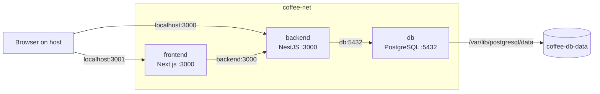

# Coffee Tracker

A full-stack application for tracking coffee beans and espresso brews, containerized with Docker and Docker Compose.

## 1. Overview

Coffee Tracker lets users add, edit and delete coffee beans, log brews (dose, yield, brew time, grind size, water temperature and rating), and view statistics on a dashboard.

Docker Compose manages three services:

| Service | Technology | Role |
| --- | --- | --- |
| `frontend` | Next.js | Serves the web application |
| `backend` | NestJS + TypeORM | REST API for beans, brews and statistics |
| `db` | PostgreSQL 17 | Stores application data |

Compose also manages the named network `coffee-net` and the persistent volume `coffee-db-data`.

## 2. Architecture



There is an important distinction between host and container networking:

- The browser loads the frontend from `localhost:3001`.
- Browser-side requests call the backend through `localhost:3000`.
- Server-rendered Next.js code runs inside Docker and calls `backend:3000`.
- The backend connects to PostgreSQL through `db:5432`.
- PostgreSQL is not exposed to the host because only the backend needs direct database access.

## 3. Prerequisites

To run the application:

- Docker Desktop or Docker Engine with Docker Compose
- Ports `3000` and `3001` available
- A `.env` file in the project root

Create the environment file from the provided example:

```bash
cp .env.example .env
```

The `.env` file contains the database configuration used by PostgreSQL and the backend. It is ignored by Git so local credentials are not committed.

No local installation of Node.js or PostgreSQL is required when running the application through Docker.

## 4. Running and Stopping

Build the images and start all services:

```bash
docker compose up --build -d
```

Check their status:

```bash
docker compose ps
```

The database and backend should report a healthy status.

Open the application at:

```text
http://localhost:3001
```

No manual database setup is required. TypeORM creates the tables when the backend starts.

Stop and remove the containers and network:

```bash
docker compose down
```

Start again without rebuilding:

```bash
docker compose up -d
```

`docker compose down` keeps the database volume, so application data survives.

Do not use `docker compose down -v` as routine cleanup because `-v` also deletes the database volume.

## 5. Docker Configuration

The main Docker configuration consists of:

| File | Purpose |
| --- | --- |
| `docker-compose.yml` | Services, ports, environment variables, health checks, resource limits, network and volume |
| `backend/Dockerfile` | Multi-stage backend build and Docker test stage |
| `frontend/Dockerfile` | Multi-stage Next.js standalone build |
| `*/.dockerignore` | Excludes unnecessary files from Docker build contexts |

Both Dockerfiles use `node:24-alpine` and multi-stage builds.

The general build process is:

1. Install dependencies in a dedicated stage.
2. Build the application in a separate stage.
3. Copy only the files required at runtime into a clean final image.
4. Run the application as the non-root `node` user.

Separating build and runtime stages keeps development dependencies, source files and build tools out of the final runtime images.

The backend additionally uses:

```bash
npm prune --omit=dev
```

to remove development dependencies before they are copied into the runtime image.

The frontend uses Next.js:

```ts
output: "standalone"
```

which creates a smaller self-contained production server.

## 6. Health Checks and Start Order

A running container does not necessarily mean that the application inside it is ready.

PostgreSQL therefore checks its readiness using `pg_isready`.

The backend waits until the database is healthy before starting. The backend then checks its own `/dashboard/stats` endpoint, and the frontend waits until the backend is healthy.

The startup sequence is therefore:

```text
PostgreSQL starts
       ↓
Database becomes healthy
       ↓
Backend starts
       ↓
Backend becomes healthy
       ↓
Frontend starts
```

Health status can be inspected using:

```bash
docker compose ps
```

## 7. Volumes and Persistence

PostgreSQL stores its data in the named volume `coffee-db-data`, mounted at `/var/lib/postgresql/data`.

The volume exists independently of the database container.

| Command | Containers | Network | Volume and Data |
| --- | --- | --- | --- |
| `docker compose stop` | Stopped | Kept | Kept |
| `docker compose down` | Removed | Removed | Kept |
| `docker compose down -v` | Removed | Removed | **Deleted** |

Persistence was tested by creating a bean, removing the containers with `docker compose down`, starting the environment again and confirming that the bean still existed.

## 8. Networking

All three services share the named Docker network `coffee-net`.

Docker provides internal DNS resolution, allowing containers to communicate using service names instead of changing IP addresses.

| Service | Host Access | Internal Docker Address |
| --- | --- | --- |
| `frontend` | `localhost:3001` | `frontend:3000` |
| `backend` | `localhost:3000` | `backend:3000` |
| `db` | None | `db:5432` |

The backend publishes port `3000` because browser-side code calls it directly.

PostgreSQL does not publish port `5432` to the host because only the backend needs database access.

## 9. Security and Efficiency

| Choice | Effect |
| --- | --- |
| Multi-stage builds | Build tools and unnecessary files stay out of runtime images |
| `node:24-alpine` | Provides a small Node.js base image |
| `npm prune --omit=dev` | Removes backend development dependencies |
| Next.js standalone output | Reduces frontend runtime requirements |
| Dependency layers before source | Allows Docker to cache `npm ci` |
| `USER node` | Application processes do not run as root |
| No database host port | PostgreSQL is only accessible through `coffee-net` |
| Resource limits | Prevent services from consuming unrestricted host resources |

The application user can be verified with:

```bash
docker compose exec backend whoami
docker compose exec frontend whoami
```

Both should return:

```text
node
```

This means the application processes run as non-root users inside their containers. It does not mean that the Docker daemon itself is running in rootless mode.

### Resource Limits

| Service | CPU | Memory |
| --- | ---: | ---: |
| `db` | 0.5 CPU | 256 MB |
| `backend` | 0.5 CPU | 256 MB |
| `frontend` | 0.5 CPU | 512 MB |

Runtime usage can be inspected with:

```bash
docker stats --no-stream
```

### Image Size

Measured with `docker image ls`:

| Backend Image | Disk Usage | Compressed |
| --- | ---: | ---: |
| Source + development dependencies | 728 MB | 148 MB |
| Final runtime image | 388 MB | 78 MB |

The final backend runtime image is approximately 47% smaller on disk.

## 10. Testing and Verification

Validate the Compose configuration:

```bash
docker compose config
```

Check container health:

```bash
docker compose ps
```

Inspect backend logs:

```bash
docker compose logs backend --tail=20
```

Run the backend unit tests in Docker:

```bash
docker compose run --rm --build backend-test
```

The `backend-test` service uses the `test` profile, so it is not started during a normal `docker compose up`.

Verify that the applications run as non-root:

```bash
docker compose exec backend whoami
docker compose exec frontend whoami
```

Inspect runtime resource usage:

```bash
docker stats --no-stream
```

## 11. Limitations and Next Steps

| Limitation | Current Approach |
| --- | --- |
| Browser API URL and CORS use localhost | Intended for local development |
| TypeORM uses `synchronize: true` | Suitable for the current local project; migrations would be preferable for production |
| Backend has unit tests but no automated end-to-end tests | Full application flow is currently tested manually |

Possible future improvements include:

- TypeORM database migrations
- Automated end-to-end testing
- CI/CD for automated builds and tests
- Production secrets management
- Deployment to a remote environment

## Project Structure

```text
coffee-tracker/
├── backend/
│   ├── src/
│   └── Dockerfile
├── frontend/
│   ├── app/
│   └── Dockerfile
├── docker-compose.yml
├── .env.example
└── README.md
```

---

Built for the Web PBA Autumn 2026 Development Environments project: containerizing an existing full-stack application with Docker and Docker Compose.