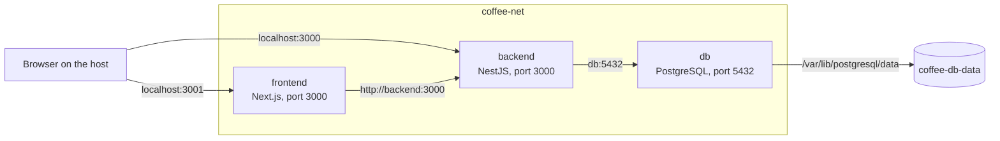

# Coffee Tracker

A full-stack app for tracking coffee beans and espresso brews, containerised with Docker Compose.

## 1. Overview

Coffee Tracker lets you add, edit and delete coffee beans, log brews (dose, yield, brew time, grind size, water temperature, rating) and see statistics on a dashboard.

Docker Compose starts, connects and stops three services:

| Service    | Technology        | Image                               | Role                            |
| ---------- | ----------------- | ----------------------------------- | ------------------------------- |
| `frontend` | Next.js           | built from `frontend/Dockerfile`    | Serves the pages to the browser |
| `backend`  | NestJS + TypeORM  | built from `backend/Dockerfile`     | REST API for beans, brews, stats |
| `db`       | PostgreSQL 17     | `postgres:17-alpine` (Docker Hub)   | Stores the data                 |

Compose also manages the network `coffee-net` and the volume `coffee-db-data`.

## 2. Architecture



- The browser loads pages from the frontend on `localhost:3001`.
- Forms and delete buttons run in the browser and call the backend directly on `localhost:3000`.
- Server-rendered pages run inside the frontend container and call the backend as `backend:3000`.
- Only the backend talks to `db`. Postgres stores its data in the named volume `coffee-db-data`.

## 3. Prerequisites

- Docker Desktop (or Docker Engine) with Compose, running.
- Ports `3000` and `3001` free on your machine.
- A `.env` file in the project root. Create it from the example:

```bash
cp .env.example .env
```

`.env` holds `DB_NAME`, `DB_USERNAME` and `DB_PASSWORD`. Compose passes them to `db` and `backend`. `.env` is git-ignored, so real passwords never reach the repository.

## 4. Running and stopping

From the project root:

```bash
docker compose up --build -d   # build images and start all services
docker compose ps              # db and backend should show (healthy)
```

Open http://localhost:3001.

No manual database setup is needed. TypeORM creates the tables when the backend starts.

```bash
docker compose down            # stop and remove containers and network
docker compose up -d           # start again without rebuilding
```

`docker compose down` keeps the volume, so your data survives. **Do not use `docker compose down -v` as routine cleanup.** It deletes `coffee-db-data` and all data with it.

## 5. Docker configuration

| File                     | Role |
| ------------------------ | ---- |
| `docker-compose.yml`     | Services, ports, environment variables, healthchecks, start order, resource limits, network and volume |
| `backend/Dockerfile`     | Multi-stage build: `deps`, `test`, `build` and a small runtime stage |
| `frontend/Dockerfile`    | Multi-stage build: `deps`, `build` and a small runtime stage (Next.js standalone) |
| `*/.dockerignore`        | Keeps `node_modules`, build output, `.env`, `coverage` and Markdown out of the build context |

Both Dockerfiles follow the same pattern on `node:24-alpine`:

1. `deps` copies only `package*.json` and runs `npm ci`. This layer is cached while dependencies are unchanged.
2. `build` copies the source and builds the app. The backend then removes dev dependencies with `npm prune --omit=dev`.
3. The runtime stage starts from a clean image, copies only the build output and runs as `USER node`.

**Start order:** `db` checks itself with `pg_isready`. `backend` waits until `db` is healthy and checks itself by calling `/dashboard/stats`. `frontend` waits until `backend` is healthy.

**Resource limits:** `db` and `backend` 0.5 CPU and 256 MB, `frontend` 0.5 CPU and 512 MB.

Run `docker compose config` to see the resolved configuration with the values from `.env`.

## 6. Volumes and persistence

| Volume           | Mounted at                              | Stores |
| ---------------- | --------------------------------------- | ------ |
| `coffee-db-data` | `/var/lib/postgresql/data` in `db`      | All Postgres tables and rows |

| Command                  | Containers        | Network  | Volume and data |
| ------------------------ | ----------------- | -------- | --------------- |
| `docker compose stop`    | stopped, kept     | kept     | kept            |
| `docker compose down`    | removed           | removed  | kept            |
| `docker compose down -v` | removed           | removed  | **deleted**     |

**Tested:** We created a bean in the browser, confirmed it with `psql`, ran `docker compose down` and `docker compose up -d`, and the bean was still there. New containers, same volume.

## 7. Networking

All three services share the named network `coffee-net`. Containers reach each other by service name.

| Service    | Host port (browser) | Internal name and port (containers) |
| ---------- | ------------------- | ----------------------------------- |
| `frontend` | `localhost:3001`    | `frontend:3000`                     |
| `backend`  | `localhost:3000`    | `backend:3000`                      |
| `db`       | none                | `db:5432`                           |

The backend publishes port 3000 because browser-side code calls it directly. The database is **not** exposed to the host. Only the backend needs it, and `docker compose ps` shows `5432/tcp` without a host mapping.

## 8. Security and efficiency

| Choice | Effect |
| ------ | ------ |
| Multi-stage builds | No source code, compiler or test tools in the runtime images |
| `alpine` base images | Small base with fewer packages |
| `npm prune --omit=dev` | Only production dependencies in the backend image |
| Next.js `output: "standalone"` | Frontend runs a small self-contained server |
| `COPY package*.json` before `COPY .` | `npm ci` is cached, so rebuilds are faster |
| `USER node` | The apps do not run as root |
| No host port on `db` | The database is only reachable inside `coffee-net` |
| Resource limits | No container can take the whole machine |

Measured with `docker image ls` (backend, Node 24):

| Image | Disk usage | Compressed |
| ----- | ---------- | ---------- |
| `coffee-tracker-backend-test` (source + all dev dependencies) | 728 MB | 148 MB |
| `coffee-tracker-backend` (final runtime image) | 388 MB | 78 MB |

Verified, not just declared: `docker compose exec backend whoami` returns `node`.

**Trade-off:** Alpine uses `musl` instead of `glibc`, which can break native Node modules. It has not affected this project.

## 9. Testing and verification

```bash
docker compose config                      # configuration is valid
docker compose ps                          # db and backend show (healthy)
docker compose logs backend --tail=20      # "Nest application successfully started"
docker compose run --rm --build backend-test   # unit tests, 14 passed
docker compose exec db psql -U coffee coffee_tracker   # then: TABLE bean;  \q to exit
docker compose exec backend whoami         # node
docker stats --no-stream                   # CPU and memory per container
```

The unit tests run in Docker through the `backend-test` service. It has the profile `test`, so `docker compose up` does not start it. The tests mock the database and check logic such as the average rating and rejecting a brew for a bean that does not exist. Use `--build` after code changes, otherwise `run` reuses the old test image.

## 10. Limitations and next steps

| Limitation or choice | Effect | Status |
| -------------------- | ------ | ------ |
| `localhost:3000` is hard-coded in browser code and CORS | Runs locally only | Deliberate: the project is for local use |
| TypeORM `synchronize: true` instead of migrations | Schema updates automatically on start | Deliberate: small local project without production data |
| Tests need Node 24 because several Nest packages are ES modules | May fail with an older local Node | Run them in Docker with `backend-test` |
| Unit tests only, no end-to-end test | Browser-to-database flow is tested manually | Next step |

## Project structure

```
coffee-tracker/
├── backend/               NestJS API + Dockerfile
├── frontend/              Next.js app + Dockerfile
├── docker-compose.yml
├── .env.example
└── README.md
```

Built for the Web PBA Autumn 2026 Development Environments project: containerising an existing web application with Docker and Docker Compose.
